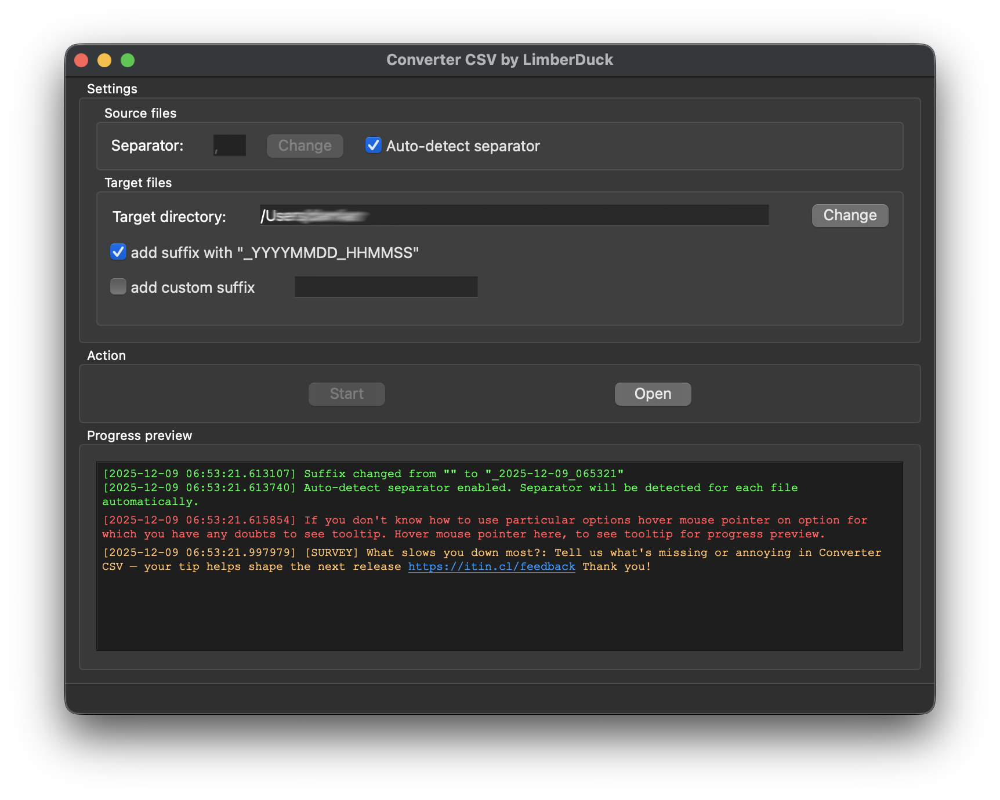

:description: GUI tool that enables you to convert CSV files to XLSX files in bulk.

Converter CSV
=============

|converter_csv_pepy_downloads| |github_downloads_latest_release| |github_downloads_all_releases| |stars_from_users| |latest_release| |latest_release_date| |license| |supported_platform|

This is a |GUI| tool which lets you convert multiple large |csv| files to |xlsx| files 
keeping your operational memory usage at a low level.
Just drag and drop |csv| files or folders containing |csv| files onto the application window, 
set your preferences, and start the conversion process. 
Converter CSV will automatically detect separators such as 
``,``, ``;``, ``tab``, ``|`` and ``:``.
Works on Windows, macOS or GNU Linux.
It's free and Open Source [#]_ tool.

.. grid:: 2 3 4 4

    .. grid-item::

      .. button-link:: https://github.com/LimberDuck/converter-csv/releases
         :color: primary
         :tooltip: Release notes and downloads

         :octicon:`download;1em;sd-color-primary-text` Download

    .. grid-item::

      .. button-link:: https://github.com/LimberDuck/converter-csv
         :color: primary
         :outline:
         :tooltip: Source code

         :octicon:`code;1em;sd-color-primary-text` Source code

    .. grid-item::

      .. button-link:: https://github.com/LimberDuck/converter-csv/discussions
         :color: primary
         :outline:
         :tooltip: Discussions

         :octicon:`comment-discussion;1em;sd-color-primary-text` Discussions

    .. grid-item::

      .. button-link:: https://github.com/LimberDuck/converter-csv/issues
         :color: primary
         :outline:
         :tooltip: Issues

         :octicon:`issue-opened;1em;sd-color-primary-text` Issues

   **Converter CSV** main window running on macOS, but works as well on Windows and Linux. 

Technology stack
----------------

.. image:: https://www.python.org/static/community_logos/python-logo-generic.svg
   :alt: Python logo
   :target: https://python.org
   :width: 220px

.. image:: https://upload.wikimedia.org/wikipedia/commons/thumb/0/0b/Qt_logo_2016.svg/578px-Qt_logo_2016.svg.png
   :alt: Qt logo
   :target: https://www.qt.io
   :width: 70px

.. image:: https://upload.wikimedia.org/wikipedia/commons/thumb/e/e6/Python_and_Qt.svg/164px-Python_and_Qt.svg.png
   :alt: PyQt logo
   :target: https://riverbankcomputing.com/software/pyqt
   :width: 60px

Stargazers over time
--------------------

.. figure:: https://starchart.cc/LimberDuck/converter-csv.svg?background=%23ffffff00&axis=%23E57333&line=%23E57333
    :target: https://starchart.cc/LimberDuck/converter-csv
    :alt: Stargazers over time
    :align: center

    Converter CSV GitHub repository stars over time.

.. |license| image:: https://img.shields.io/github/license/LimberDuck/converter-csv.svg?style=social
    :target: https://github.com/LimberDuck/converter-csv/blob/master/LICENSE
    :alt: License

.. |supported_platform| image:: https://img.shields.io/badge/platform-Windows%20%7C%20macOS%20%7C%20Linux-lightgrey.svg?style=social
    :target: https://github.com/LimberDuck/converter-csv
    :alt: Supported platform

.. |stars_from_users| image:: https://img.shields.io/github/stars/LimberDuck/converter-csv?label=Stars&style=social
    :target: https://github.com/LimberDuck/converter-csv
    :alt: GitHub Stars

.. |latest_release| image:: https://img.shields.io/github/v/release/LimberDuck/converter-csv?label=Latest%20release&style=social
    :target: https://github.com/LimberDuck/converter-csv/releases
    :alt: Latest Release version

.. |latest_release_date| image:: https://img.shields.io/github/release-date/limberduck/converter-csv?label=released&style=social
    :target: https://github.com/LimberDuck/converter-csv/releases
    :alt: GitHub Release Date

.. |pypi_downloads| image:: https://img.shields.io/pypi/dm/converter-csv?logo=PyPI&style=social   
    :target: https://pypistats.org/packages/converter-csv
    :alt: PyPI - Downloads

.. |converter_csv_pepy_downloads| image:: https://img.shields.io/pepy/dt/converter-csv?logo=PyPI&style=social   
    :target: https://pepy.tech/projects/converter-csv
    :alt: pepy.tech - Total Downloads

.. |github_downloads_all_releases| image:: https://img.shields.io/github/downloads/LimberDuck/converter-csv/total?style=social&label=all%20releases%20downloads&logo=GitHub
   :target: https://github.com/LimberDuck/converter-csv/releases
   :alt: GitHub Downloads (all assets, all releases) since v0.4.1

.. |github_downloads_latest_release| image:: https://img.shields.io/github/downloads/LimberDuck/converter-csv/latest/total?style=social&label=latest%20release%20downloads&logo=GitHub
   :target: https://github.com/LimberDuck/converter-csv/releases/latest
   :alt: GitHub Downloads (all assets, latest release)

----

.. rubric:: Footnotes

.. [#] read more about :term:`Open Source` in glossary

.. toctree::
   :hidden:

   installation
   running
   building
   using
   settings
