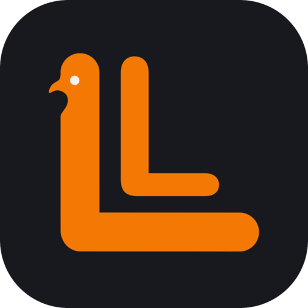
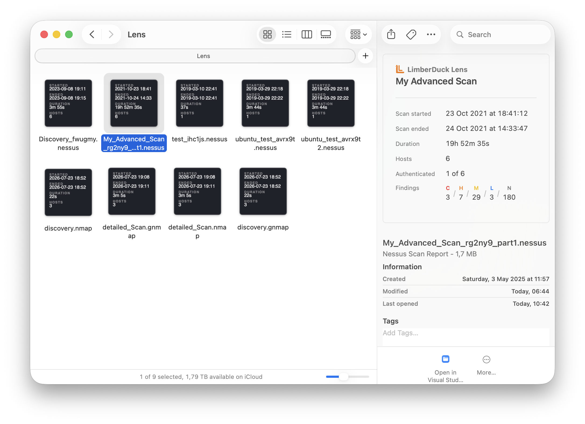

:description: GUI tool with Finder and Files app extensions for previewing Tenable Nessus and Nmap files.

Lens
====

This is a |GUI| tool and an extension for the macOS Finder and iOS/iPadOS Files app.
It enables you to preview scan files produced by *Tenable Nessus*,
*Tenable Security Center* and |Nmap|, used for the |VA| [1]_ process.

Thanks to Lens, you will be able to quickly identify the right scan files and
preview their results without opening them in a separate application.

.. https://developer.apple.com/app-store/marketing/guidelines/

.. grid:: 2 2 2 2

    .. grid-item::
      :class: store-badge-item

      .. image:: ../../_static/img/logos/Download_on_the_Mac_App_Store_Badge_US-UK_RGB_blk_092917.svg
         :alt: Download on the Mac App Store
         :target: https://apps.apple.com/app/limberduck-lens/id6792565446?platform=mac
         :height: 50px
         :align: center

    .. grid-item::
      :class: store-badge-item

      .. image:: ../../_static/img/logos/Download_on_the_App_Store_Badge_US-UK_RGB_blk_092917.svg
         :alt: Download on the App Store
         :target: https://apps.apple.com/app/limberduck-lens/id6792565446?platform=ios
         :height: 50px
         :align: center

   **LimberDuck Lens** Finder Thumbnail and Quick Look preview of a Nessus and Nmap scan file on macOS

.. .. note::

..     More info soon.

How to use
----------

.. important::

    LimberDuck Lens works entirely on-device,
    scan files are never uploaded anywhere,
    and the app has no network access at all.

If you are on macOS, open Finder. If you are on iOS or iPadOS, open the Files app.
Go to the directory where your Nessus (``.nessus``) or Nmap (``.nmap``, ``.gnmap``, ``.xml`` [2]_ ) scan files are stored.

1. You will see a scan preview in the file's Thumbnail containing the following information:
    - Scan start time
    - Scan end time
    - Scan duration
    - Number of hosts scanned

2. On macOS, if you have the Preview sidebar enabled in Finder, you will see a Quick Look preview of the scan results when you select a file. You will see there:
    - Scan name
    - Scan start time
    - Scan end time
    - Scan duration
    - Number of hosts scanned
    - Number of scanned hosts with authentication (if applicable)
    - Number of findings broken down by risk factor

    .. hint::

        To enable the Finder Preview sidebar, go to the Finder menu *View* and
        select the *Show Preview* option, or press the :bdg-secondary-line:`Command` + :bdg-secondary-line:`Shift` + :bdg-secondary-line:`P` keyboard shortcut.

3. To open a Quick Look preview of the scan results in a separate window, you have a few options. Select a file and:
    - press :bdg-secondary-line:`Space` (macOS)
    - press :bdg-secondary-line:`Command` + :bdg-secondary-line:`Y` (macOS)
    - right click and select *Quick Look* from the contextual menu (macOS/iOS/iPadOS)
    - tap on the file (iOS/iPadOS)

4. Open a Nessus (``.nessus``) or Nmap (``.nmap``, ``.gnmap``, ``.xml`` [2]_) scan file directly in the Lens app for more details:
    - **Summary** tab with:
        - scan name, start time, end time, duration, number of hosts scanned, and number of scanned hosts with authentication (if applicable)
        - a diagram with the number of findings broken down by risk factor
        - a visual scan timeline to easily see, for each host, when the scan started and ended and how long it took
    - **Hosts** tab with a sortable, filterable list of every scanned host.
    - **Findings** tab with every finding, grouped by severity and filterable by host, finding name, or severity.
    - Click the :octicon:`share` (share) button in the top right corner to export and save or share the full report as a |PDF|.
    - Click the :octicon:`eye` (eye) button in the top right corner to anonymize all hostnames in the app and the exported |PDF| file.

Supported files & platforms
----------------------------

.. list-table::
   :class: support-matrix
   :header-rows: 1
   :stub-columns: 2
   :widths: 10 15 15 15 15 15 15 15

   * - Extension
     - Tool
     - Finder Thumbnail (macOS)
     - Finder Quick Look (macOS)
     - Lens app (macOS)
     - Files Thumbnail (iOS / iPadOS)
     - Files Quick Look (iOS / iPadOS)
     - Lens app (iOS / iPadOS)
   * - ``.nessus``
     - Tenable Nessus
     - :octicon:`check;2em;sd-text-success`
     - :octicon:`check;2em;sd-text-success`
     - :octicon:`check;2em;sd-text-success`
     - :octicon:`check;2em;sd-text-success`
     - :octicon:`check;2em;sd-text-success`
     - :octicon:`check;2em;sd-text-success`
   * - ``.nessus``
     - Tenable Security Center
     - :octicon:`check;2em;sd-text-success`
     - :octicon:`check;2em;sd-text-success`
     - :octicon:`check;2em;sd-text-success`
     - :octicon:`check;2em;sd-text-success`
     - :octicon:`check;2em;sd-text-success`
     - :octicon:`check;2em;sd-text-success`
   * - ``.nmap``
     - Nmap
     - :octicon:`check;2em;sd-text-success`
     - :octicon:`check;2em;sd-text-success`
     - :octicon:`check;2em;sd-text-success`
     - :octicon:`check;2em;sd-text-success`
     - :octicon:`check;2em;sd-text-success`
     - :octicon:`check;2em;sd-text-success`
   * - ``.gnmap``
     - Nmap
     - :octicon:`check;2em;sd-text-success`
     - :octicon:`check;2em;sd-text-success`
     - :octicon:`check;2em;sd-text-success`
     - :octicon:`check;2em;sd-text-success`
     - :octicon:`check;2em;sd-text-success`
     - :octicon:`check;2em;sd-text-success`
   * - ``.xml``
     - Nmap
     - :octicon:`check;2em;sd-text-success`
     - :octicon:`check;2em;sd-text-success`
     - :octicon:`check;2em;sd-text-success`
     - :octicon:`dash;2em;sd-text-muted` [2]_
     - :octicon:`dash;2em;sd-text-muted` [2]_
     - :octicon:`check;2em;sd-text-success`

Technology stack
-----------------

Built natively with Swift and SwiftUI, using Finder / Files Quick Look and Thumbnail
extensions on macOS, iOS and iPadOS.

Privacy Policy
--------------

The LimberDuck Lens app does not collect, transmit, or store any personal data. All files stay on-device.

Support
-------

For support, visit the :doc:`../../../contact/index` page.

----

.. rubric:: Footnotes

.. [1] read more about :term:`Vulnerability Assessment` in glossary
.. [2] Nmap's ``.xml`` works fine on macOS, but iOS reserves Quick Look previews 
    for generic XML files. Scan with -oG/-oN (or -oA for all three) to also get a 
    .gnmap/.nmap file for the full preview experience in Files app on iOS.
