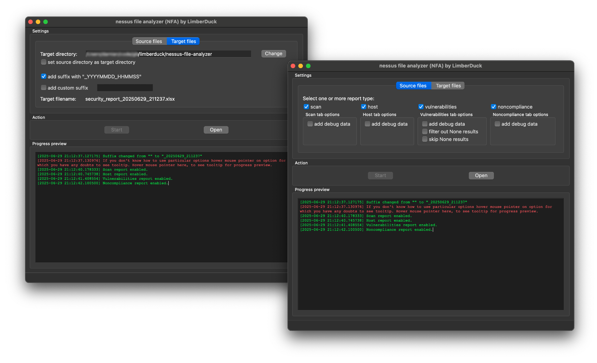

:description: GUI tool which enables you to analyze nessus files.

nessus file analyzer (NFA)
==========================

|nfa_pepy_downloads| |github_downloads_latest_release| |github_downloads_all_releases| |stars_from_users| |latest_release| |latest_release_date| |license| |supported_platform| 

.. image:: ../../_static/img/LimberDuck-nessus-file-analyzer-logo.png
   :alt: LimberDuck nessus-file-analyzer logo
   :width: 120px
   :align: left
   :target: .

This is a |GUI| tool which enables you to parse multiple nessus files containing the 
results of scans performed by using *Tenable Nessus* or *Tenable Security Center* by 
© Tenable, Inc. used for |VA| [1]_ process. Parsed scan results are exported to a 
spreadsheet file for effortless analysis. 

Operational memory usage will 
be kept low while parsing even the largest of files. You can run it on your favorite 
operating system, whether it is Windows, macOS or GNU Linux. As a parsing result, you 
will receive spreadsheets with a summary view of the whole scan and/or all reported 
hosts. You will also be able to generate spreadsheets with a detailed view of all 
reported vulnerabilities [2]_ and/or noncompliance. It's free and Open Source [3]_ tool.

.. grid:: 2 3 4 4

    .. grid-item::

      .. button-link:: https://github.com/LimberDuck/nessus-file-analyzer/releases
         :color: primary
         :tooltip: Release notes and downloads

         :octicon:`download;1em;sd-color-primary-text` Download

    .. grid-item::

      .. button-link:: https://github.com/LimberDuck/nessus-file-analyzer
         :color: primary
         :outline:
         :tooltip: Source code

         :octicon:`code;1em;sd-color-primary-text` Source code

    .. grid-item::

      .. button-link:: https://github.com/LimberDuck/nessus-file-analyzer/discussions
         :color: primary
         :outline:
         :tooltip: Discussions

         :octicon:`comment-discussion;1em;sd-color-primary-text` Discussions

    .. grid-item::

      .. button-link:: https://github.com/LimberDuck/nessus-file-analyzer/issues
         :color: primary
         :outline:
         :tooltip: Issues

         :octicon:`issue-opened;1em;sd-color-primary-text` Issues

.. .. list-table:: nessus-file-analyzer details
..     :widths: 25 75
..     :stub-columns: 1

..     * - source code
..       - https://github.com/LimberDuck/nessus-file-analyzer

..     * - release notes
..       - https://github.com/LimberDuck/nessus-file-analyzer/releases

..     * - changelog
..       - https://github.com/LimberDuck/nessus-file-analyzer/blob/master/CHANGELOG.md

..     * - documentation
..       - https://nessus-file-analyzer.readthedocs.io

   **nessus file analyzer (NFA)** main window running on macOS, but works as well on Windows and Linux. 

Technology stack
----------------

.. image:: https://www.python.org/static/community_logos/python-logo-generic.svg
   :alt: Python logo
   :target: https://python.org
   :width: 220px

.. image:: https://upload.wikimedia.org/wikipedia/commons/thumb/0/0b/Qt_logo_2016.svg/578px-Qt_logo_2016.svg.png
   :alt: Qt logo
   :target: https://www.qt.io
   :width: 70px

.. image:: https://upload.wikimedia.org/wikipedia/commons/thumb/e/e6/Python_and_Qt.svg/164px-Python_and_Qt.svg.png
   :alt: PyQt logo
   :target: https://riverbankcomputing.com/software/pyqt
   :width: 60px

Latest NFA news
---------------

.. postlist::
   :language: en
   :date: %Y-%m-%d
   :format: {date} - {title}
   :list-style: circle
   :tags: NFA

Testimonials
------------

   I love the Nessus File Analyzer, so thank you so much for sharing and maintaining.

   -- User

   Tested everyday. Works perfect.

   -- User

   Brilliant work!

   -- User

   This tool is really helpful! Thanks for sharing this.

   -- User

   I found nessus file analyzer to be an excellent tool.

   -- User

   First of all... Great tool! You did a really great job! Thanks for developing such a wonderful tool!

   -- User

   I'm grateful for your software...

   -- User

Stargazers over time
--------------------

.. figure:: https://starchart.cc/LimberDuck/nessus-file-analyzer.svg?background=%23ffffff00&axis=%23E57333&line=%23E57333
    :target: https://starchart.cc/LimberDuck/nessus-file-analyzer
    :alt: Stargazers over time
    :align: center

    **nessus file analyzer (NFA)** GitHub repository stars over time.

----

.. rubric:: Footnotes

.. [1] read more about :term:`Vulnerability Assessment` in glossary
.. [2] read more about :term:`vulnerability` in glossary 
.. [3] read more about :term:`Open Source` in glossary

.. |license| image:: https://img.shields.io/github/license/LimberDuck/nessus-file-analyzer.svg?style=social
    :target: https://github.com/LimberDuck/nessus-file-analyzer/blob/master/LICENSE
    :alt: License

.. |supported_platform| image:: https://img.shields.io/badge/platform-Windows%20%7C%20macOS%20%7C%20Linux-lightgrey.svg?style=social
    :target: https://github.com/LimberDuck/nessus-file-analyzer
    :alt: Supported platform

.. |stars_from_users| image:: https://img.shields.io/github/stars/LimberDuck/nessus-file-analyzer?label=Stars&style=social
    :target: https://github.com/LimberDuck/nessus-file-analyzer
    :alt: GitHub Stars

.. |latest_release| image:: https://img.shields.io/github/v/release/LimberDuck/nessus-file-analyzer?label=Latest%20release&style=social
    :target: https://github.com/LimberDuck/nessus-file-analyzer/releases
    :alt: Latest Release version

.. |latest_release_date| image:: https://img.shields.io/github/release-date/limberduck/nessus-file-analyzer?label=released&style=social
    :target: https://github.com/LimberDuck/nessus-file-analyzer/releases
    :alt: GitHub Release Date

.. |pypi_downloads| image:: https://img.shields.io/pypi/dm/nessus-file-analyzer?logo=PyPI&style=social   
    :target: https://pypistats.org/packages/nessus-file-analyzer
    :alt: PyPI - Downloads

.. |nfa_pepy_downloads| image:: https://img.shields.io/pepy/dt/nessus-file-analyzer?logo=PyPI&style=social   
    :target: https://pepy.tech/projects/nessus-file-analyzer
    :alt: pepy.tech - Total Downloads

.. |github_downloads_all_releases| image:: https://img.shields.io/github/downloads/LimberDuck/nessus-file-analyzer/total?style=social&label=All%20downloads%20since%20release%20v0.10&logo=GitHub
   :target: https://github.com/LimberDuck/nessus-file-analyzer/releases
   :alt: GitHub Downloads (all assets, all releases) since v0.10

.. |github_downloads_latest_release| image:: https://img.shields.io/github/downloads/LimberDuck/nessus-file-analyzer/latest/total?style=social&label=latest%20release%20downloads&logo=GitHub
   :target: https://github.com/LimberDuck/nessus-file-analyzer/releases/latest
   :alt: GitHub Downloads (all assets, latest release)

.. toctree::
   :hidden:

   installation
   running
   building
   using
   settings
   standard-reports/index
   advanced-reports/index
