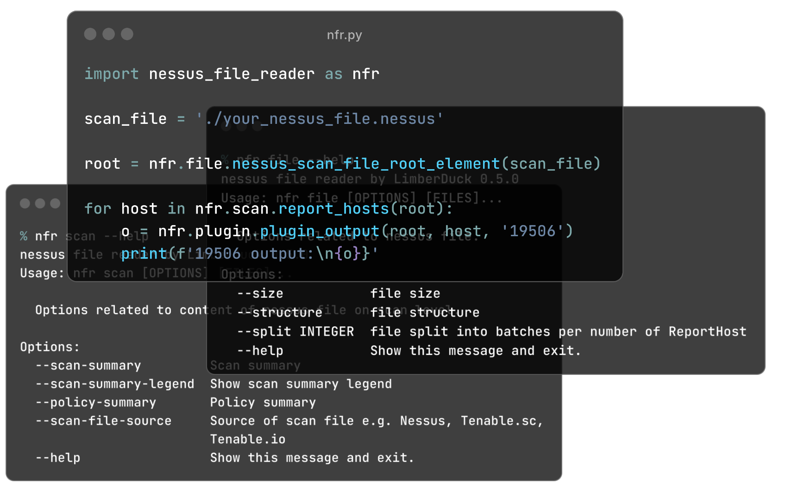

:description: CLI tool and python module which enables you to parse nessus files.

nessus file reader (NFR)
========================

|pypi_downloads| |stars_from_users| |latest_release| |latest_release_date| |license| |supported_platform|

This is a |CLI| tool and python module which enables you to quickly parse nessus files containing the results 
of scans performed by using *Tenable Nessus* or *Tenable Security Center* by © Tenable, Inc. used
for |VA| [1]_ process. This module will let you get data 
through functions grouped into categories like file, scan, host, and plugin to get 
specific information from the provided nessus scan files e.g. file size, report name, 
report hosts names, the number of target hosts, the number of hosts scanned with 
credentialed checks, the number of reported plugins per Risk Factor, exact host scan 
times, outputs of particular plugins and a lot more. It's free and Open Source [2]_ tool.

.. |nbsp| unicode:: 0xA0 
   :trim:

.. grid:: 2 2 2 4

    .. grid-item::

      .. button-link:: https://github.com/LimberDuck/nessus-file-reader
         :color: primary
         :outline:
         :tooltip: Check source code here

         :octicon:`code;1em;sd-color-primary-text` source code

    .. grid-item::

      .. button-link:: https://github.com/LimberDuck/nessus-file-reader/releases
         :color: primary
         :outline:
         :tooltip: Check release notes here

         :octicon:`note;1em;sd-color-primary-text` release notes

    .. grid-item::

      .. button-link:: https://github.com/LimberDuck/nessus-file-reader/discussions
         :color: primary
         :outline:
         :tooltip: Discuss here

         :octicon:`comment-discussion;1em;sd-color-primary-text` discussions

    .. grid-item::

      .. button-link:: https://github.com/LimberDuck/nessus-file-reader/issues
         :color: primary
         :outline:
         :tooltip: Report issues here

         :octicon:`issue-opened;1em;sd-color-primary-text` issues

.. .. list-table:: nessus-file-reader details
..     :widths: 25 75
..     :stub-columns: 1

..     * - source code
..       - https://github.com/LimberDuck/nessus-file-reader
  
..     * - release notes
..       - https://github.com/LimberDuck/nessus-file-reader/releases
  
..     * - changelog
..       - https://github.com/LimberDuck/nessus-file-reader/blob/master/CHANGELOG.md

   **nessus file reader (NFR)** as Python module and |CLI| running in Terminal

Technology stack
----------------

.. image:: https://www.python.org/static/community_logos/python-logo-master-v3-TM.png
   :alt: Python logo
   :target: https://python.org
   :width: 220px

Stargazers over time
--------------------

.. figure:: https://starchart.cc/LimberDuck/nessus-file-reader.svg?variant=adaptive
    :target: https://starchart.cc/LimberDuck/nessus-file-reader
    :alt: Stargazers over time
    :align: center

    **nessus file reader (NFR)** GitHub repository stars over time.

.. Instructions
.. ------------

.. toctree::
   :hidden:

   installation
   running
   using
   programming

----

.. rubric:: Footnotes

.. [1] read more about :term:`Vulnerability Assessment` in glossary
.. [2] read more about :term:`Open Source` in glossary

.. |license| image:: https://img.shields.io/github/license/LimberDuck/nessus-file-reader.svg?style=social
    :target: https://github.com/LimberDuck/nessus-file-reader/blob/master/LICENSE
    :alt: License

.. |supported_platform| image:: https://img.shields.io/badge/platform-Windows%20%7C%20macOS%20%7C%20Linux-lightgrey.svg?style=social
    :target: https://github.com/LimberDuck/nessus-file-reader
    :alt: Supported platform

.. |stars_from_users| image:: https://img.shields.io/github/stars/LimberDuck/nessus-file-reader?label=Stars&style=social
    :target: https://github.com/LimberDuck/nessus-file-reader
    :alt: GitHub Stars

.. |latest_release| image:: https://img.shields.io/github/v/release/LimberDuck/nessus-file-reader?label=Latest%20release&style=social
    :target: https://github.com/LimberDuck/nessus-file-reader/releases
    :alt: Latest Release version

.. |latest_release_date| image:: https://img.shields.io/github/release-date/limberduck/nessus-file-reader?label=released&style=social
    :target: https://github.com/LimberDuck/nessus-file-reader/releases
    :alt: GitHub Release Date

.. |pypi_downloads| image:: https://img.shields.io/pypi/dm/nessus-file-reader?logo=PyPI&style=social   
    :target: https://pypistats.org/packages/nessus-file-reader
    :alt: PyPI - Downloads

