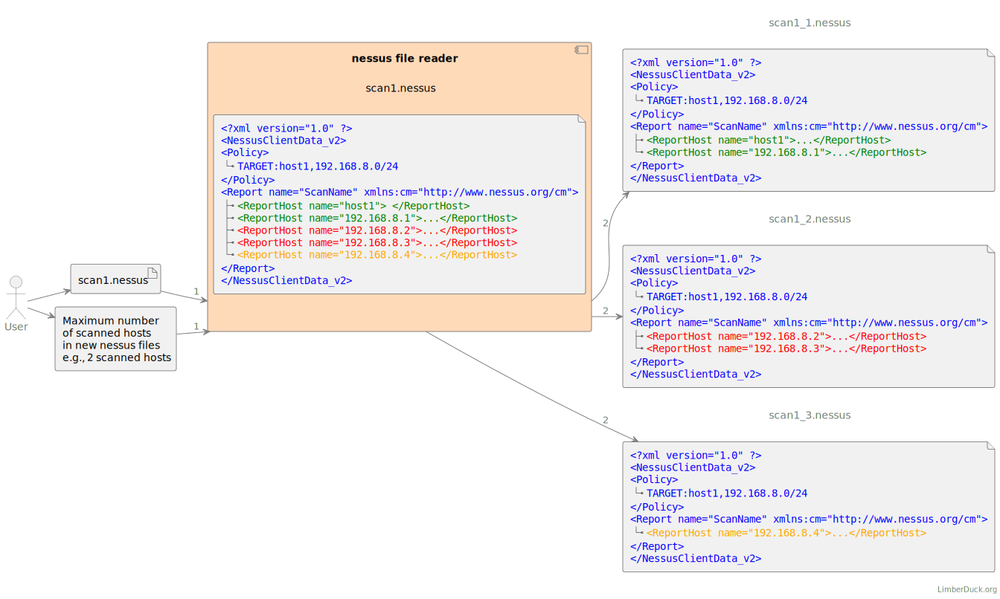

:description: Using instruction for nessus file reader (nfr).

#####
Using
#####

``nfr --help``
==============

Check help for **nessus file reader (NFR)** commands using ``nfr [command] --help``.

``nfr file``
============

``nfr file --help``
-------------------

Run ``nfr file --help`` to see options related to nessus file.

.. _nfr-file-size:

``nfr file --size``
-------------------

Check size of given file:

.. code-block:: shell

   nfr file --size test_files/scan_avrx9t.nessus
   nessus file reader by LimberDuck 0.4.2
   test_files/scan_avrx9t.nessus 2.4 MiB

Check size of more than one file:

.. code-block:: shell

   nfr file --size test_files/scan_avrx9t.nessus test_files/scan_ihc1js.nessus
   nessus file reader by LimberDuck 0.4.2
   test_files/scan_avrx9t.nessus 2.4 MiB
   test_files/scan_ihc1js.nessus 5.0 MiB

Check size of all files in given directory and it's subdirectories:

.. code-block:: shell

   nfr file --size test_files  
   nessus file reader by LimberDuck 0.4.2                                                      
   test_files/scan_avrx9t.nessus 2.4 MiB
   test_files/scan_ihc1js.nessus 5.0 MiB
   test_files/test_subdirectory/scan_ihc1js.nessus 878.3 KiB

``nfr file --structure``
------------------------

Check structure of given file:

.. code-block:: shell

   nfr file --structure test_files/scan_avrx9t.nessus
   nessus file reader by LimberDuck 0.4.2
   test_files/scan_avrx9t.nessus
   Policy [2/2]
   ├── policyName [3/3]
   ├── Preferences [2/3]
   │   ├── ServerPreferences [1/1]
   │   │   ├── preference [54/54]
   │   │   │   ├── name [1/1]
   │   │   │   └── value [0/1]
   │   │   ├── preference [53/54]
   ...
   │   └── PluginsPreferences [0/1]
   │       ├── item [506/506]
   │       │   ├── pluginName [6/6]
   │       │   ├── pluginId [5/6]
   │       │   ├── fullName [4/6]
   │       │   ├── preferenceName [3/6]
   │       │   ├── preferenceType [2/6]
   │       │   ├── preferenceValues [1/6]
   │       │   └── selectedValue [0/6]
   │       ├── item [505/506]
   ...
   ├── FamilySelection [1/3]
   │   ├── FamilyItem [53/53]
   │   │   ├── FamilyName [1/1]
   │   │   └── Status [0/1]
   │   ├── FamilyItem [52/53]
   │   │   ├── FamilyName [1/1]
   │   │   └── Status [0/1]
   ...
   └── IndividualPluginSelection [0/3]
   │   ├── PluginItem [6/6]
   │   │   ├── PluginId [3/3]
   │   │   ├── PluginName [2/3]
   │   │   ├── Family [1/3]
   │   │   └── Status [0/3]
   ...
   Report [1/2]
   └── ReportHost [0/0]
      ├── HostProperties [409/409]
      │   ├── tag [354/354]
      │   ├── tag [353/354]
   ...
      ├── ReportItem [408/409]
      │   ├── agent [12/12]
      │   ├── description [11/12]
      │   ├── fname [10/12]
      │   ├── plugin_modification_date [9/12]
      │   ├── plugin_name [8/12]
      │   ├── plugin_publication_date [7/12]
      │   ├── plugin_type [6/12]
      │   ├── risk_factor [5/12]
      │   ├── script_version [4/12]
      │   ├── see_also [3/12]
      │   ├── solution [2/12]
      │   ├── synopsis [1/12]
      │   └── plugin_output [0/12]
   ...

.. seealso::

   Check whole example structure `scan_avrx9t_structure.txt <https://github.com/LimberDuck/nessus-file-reader/blob/master/examples/scan_avrx9t_structure.txt>`_.

.. _nfr-file-split:

``nfr file --split``
--------------------

.. versionadded:: v0.5.0

   Splitting the file with Nessus scan results into smaller files.
   :ref:`nfr-upgrade` now!

This feature is useful when a file with Nessus scan results is too big for later processing. Thanks to this feature, you can split it into smaller files with a maximum number of scanned hosts (SH) in each file.

.. caution::
   This command changes the structure of the file with Nessus scan results. Before you proceed:
      1. **Make a copy of the original file!**
      2. To double-check, compare output files with the original file, e.g., using Visual Studio Code, see `here <https://code.visualstudio.com/docs/editing/codebasics#_compare-files>`_.
      3. Read this instruction carefully.

As a first step you need to check the file size and number of scanned hosts (SH) in it.
You can do it with the following commands:

1. Check the file size with the command :ref:`nfr-file-size`, e.g., ``nfr file --size scan1.nessus``.
2. Check the number of scanned hosts (SH) with the command :ref:`nfr-scan-scan-summary`, e.g., ``nfr scan --scan-summary scan1.nessus``. 

Then you need to provide to **LimberDuck nessus file reader (NFR)** as an input:

1. Maximum number of ``ReportHosts`` that you want to have in target files, e.g., ``--split 100`` will split the file into smaller files with a maximum number of 100 ``ReportHosts`` in each file.
2. File(s) or directory(ies) with Nessus scan results.

.. code-block:: shell
   :caption: Example of splitting a file with Nessus scan results into smaller files.
   :emphasize-lines: 4-6,8,10-12
   :name: nfr-file-split-example

   nfr file --split 100 ./directory ./directory2
   nessus file reader by LimberDuck 0.5.0
   ./directory/192_168_8_0_24_3mf2o4.nessus
   ./directory/192_168_8_0_24_3mf2o4_part1.nessus
   ./directory/192_168_8_0_24_3mf2o4_part2.nessus
   ./directory/192_168_8_0_24_3mf2o4_part3.nessus
   ./directory/subdirectory/My_Advanced_Scan_for_192_168_8_0_24_rg2ny9.nessus
   ./directory/subdirectory/My_Advanced_Scan_for_192_168_8_0_24_rg2ny9_part1.nessus
   ./directory2/192_168_8_0_24_3mf2o4.nessus
   ./directory2/192_168_8_0_24_3mf2o4_part1.nessus
   ./directory2/192_168_8_0_24_3mf2o4_part2.nessus
   ./directory2/192_168_8_0_24_3mf2o4_part3.nessus

.. tip::
   Run :ref:`nfr-file-size` and :ref:`nfr-scan-scan-summary` commands to quickly check the size and number of hosts in every new file, e.g.:

   ``nfr file --size ./directory ./directory2``

   ``nfr scan --scan-summary ./directory ./directory2``

Note that the general file structure doesn't change (marked in blue in the diagram below). All new output files will contain the same general file structure. Affected section is ``<ReportHost> </ReportHost>`` within ``<Report> </Report>`` section. 

1. A first new file will contain the first two hosts ``<ReportHost> </ReportHost>`` from the source file (marked in green in the diagram above).
2. A second new file will contain third and fourth hosts ``<ReportHost> </ReportHost>`` from the source file (marked in red in the diagram above).
3. A third new file will contain the fifth host ``<ReportHost> </ReportHost>`` from the source file (marked in orange in the diagram above).

    Diagram explaining the splitting process with LimberDuck nessus file reader (NFR).

.. warning::
   ``<Policy> </Policy>`` section remains the same in all new output files. It means that the ``TARGET`` specified to scan, e.g., 100 hosts, will be visible in every new file even if you split source file per 20 hosts in ``<Report> </Report>`` section.

``nfr scan``
============

``nfr scan --help``
-------------------

Run ``nfr scan --help`` to see options related to content of nessus file on scan level.

.. _nfr-scan-scan-summary:

``nfr scan --scan-summary``
---------------------------

See scan summary of given file/-s or all files in given directory and it's subdirectories:

.. code-block:: shell

   nfr scan --scan-summary scan_avrx9t.nessus
   nessus file reader by LimberDuck 0.4.2
   File name           Report name     TH    SH    CC    C    H    M    L    N
   ------------------  ------------  ----  ----  ----  ---  ---  ---  ---  ---
   scan_avrx9t.nessus  test scan        1     1     1   48  182  126   15   38

``nfr scan --scan-summary-legend``
----------------------------------

See description of columns returned in ``nfr scan --scan-summary``.

.. code-block:: shell

   nfr scan --scan-summary-legend                              
   nessus file reader by LimberDuck 0.4.2
   Legend for scan summary:
   File name - nessus file name
   Report name - report name for given nessus file name
   TH - number of target hosts
   SH - number of scanned hosts
   CC - number of hosts scanned with credentials (Credentialed checks yes in Plugin ID 19506)
   C - number of plugins with Critical risk factor for whole scan
   H - number of plugins with High risk factor for whole scan
   M - number of plugins with Medium risk factor for whole scan
   L - number of plugins with Low risk factor for whole scan
   N - number of plugins with None risk factor for whole scan

.. _nfr-scan-plugin-severity:

``nfr scan --plugin-severity``
------------------------------

.. versionadded:: v0.6.0

   Compare severity assigned to plugins.
   :ref:`nfr-upgrade` now!

Compare severity scores assigned to plugin like Severity, Risk Factor, |CVSSv2|, |CVSSv3|, |CVSSv4|, |VPR|, |EPSS|. 
Just point the name or path to nessus file with scan results.

.. code-block:: shell

   nfr scan --plugin-severity 192_168_1_1_1022nb.nessus 
   nessus file reader (NFR) by LimberDuck 0.6.0
   File name                  Report host name       PID    S  SL      RF        CVSSv2  CVSSv2L      CVSSv3  CVSSv3L    CVSSv4    CVSSv4L      VPR  VPRL      EPSS  EPSS%
   -------------------------  ------------------  ------  ---  ------  ------  --------  ---------  --------  ---------  --------  ---------  -----  ------  ------  -------
   192_168_1_1_1022nb.nessus  192.168.1.10         12217    2  Medium  Medium       5    Medium          5.3  Medium
   192_168_1_1_1022nb.nessus  192.168.1.10         42263    2  Medium  Medium       5.8  Medium          6.5  Medium
   192_168_1_1_1022nb.nessus  192.168.1.10         50686    2  Medium  Medium       5.8  Medium          6.5  Medium                            4.9  Medium  0.0596  6.0%
   192_168_1_1_1022nb.nessus  192.168.1.10         10114    1  Low     Low          2.1  Low                                                    2.2  Low     0.0037  0.4%
   192_168_1_1_1022nb.nessus  192.168.1.10         10663    1  Low     Low          3.3  Low
   192_168_1_1_1022nb.nessus  192.168.1.10         70658    1  Low     Low          2.6  Low             3.7  Low                               1.4  Low     0.0307  3.1%
   192_168_1_1_1022nb.nessus  192.168.1.10         71049    1  Low     Low          2.6  Low
   192_168_1_1_1022nb.nessus  192.168.1.10        153953    1  Low     Low          2.6  Low             3.7  Low
   192_168_1_1_1022nb.nessus  192.168.1.10         10107    0  Info    None
   192_168_1_1_1022nb.nessus  192.168.1.10         10267    0  Info    None

Use ``-f`` or ``--filter`` to check only one Plugin ID among all scan results. Read more about `JMESPath <https://jmespath.org>`_.

.. code-block:: shell

   nfr scan --plugin-severity *.nessus -f "[?PID == '50686']"
   nessus file reader (NFR) by LimberDuck 0.6.0
   File name                          Report host name      PID    S  SL      RF        CVSSv2  CVSSv2L      CVSSv3  CVSSv3L    CVSSv4    CVSSv4L      VPR  VPRL      EPSS  EPSS%
   ---------------------------------  ------------------  -----  ---  ------  ------  --------  ---------  --------  ---------  --------  ---------  -----  ------  ------  -------
   192_168_1_1_1022nb-1.nessus        192.168.1.10        50686    2  Medium  Medium       5.8  Medium          6.5  Medium                            4.9  Medium  0.0596  6.0%
   192_168_1_1_1022nb-2.nessus        192.168.1.10        50686    2  Medium  Medium       5.8  Medium          6.5  Medium                            4.9  Medium  0.0596  6.0%

Use ``-f`` or ``--filter`` to check only these plugins which have |VPR| assigned. Read more about `JMESPath <https://jmespath.org>`_.

.. code-block:: shell

   nfr scan --plugin-severity 192_168_1_1_1022nb.nessus -f "[?VPR != null]"   
   nessus file reader (NFR) by LimberDuck 0.6.0
   File name                  Report host name      PID    S  SL      RF        CVSSv2  CVSSv2L      CVSSv3  CVSSv3L    CVSSv4    CVSSv4L      VPR  VPRL      EPSS  EPSS%
   -------------------------  ------------------  -----  ---  ------  ------  --------  ---------  --------  ---------  --------  ---------  -----  ------  ------  -------
   192_168_1_1_1022nb.nessus  192.168.1.10        50686    2  Medium  Medium       5.8  Medium          6.5  Medium                            4.9  Medium  0.0596  6.0%
   192_168_1_1_1022nb.nessus  192.168.1.10        10114    1  Low     Low          2.1  Low                                                    2.2  Low     0.0037  0.4%
   192_168_1_1_1022nb.nessus  192.168.1.10        70658    1  Low     Low          2.6  Low             3.7  Low                               1.4  Low     0.0307  3.1%

Use ``-f`` or ``--filter`` to check only these plugins which have, e.g., |CVSSv3| score greater than ``4.0``. Read more about `JMESPath <https://jmespath.org>`_.

.. code-block:: shell

   nfr scan --plugin-severity 192_168_1_1_1022nb.nessus -f "[?CVSSv3 > '4.0']"
   nessus file reader (NFR) by LimberDuck 0.6.0
   File name                  Report host name      PID    S  SL      RF        CVSSv2  CVSSv2L      CVSSv3  CVSSv3L    CVSSv4    CVSSv4L      VPR  VPRL      EPSS  EPSS%
   -------------------------  ------------------  -----  ---  ------  ------  --------  ---------  --------  ---------  --------  ---------  -----  ------  ------  -------
   192_168_1_1_1022nb.nessus  192.168.1.10        12217    2  Medium  Medium       5    Medium          5.3  Medium
   192_168_1_1_1022nb.nessus  192.168.1.10        42263    2  Medium  Medium       5.8  Medium          6.5  Medium
   192_168_1_1_1022nb.nessus  192.168.1.10        50686    2  Medium  Medium       5.8  Medium          6.5  Medium                            4.9  Medium  0.0596  6.0%

``nfr scan --plugin-severity-legend``
-------------------------------------

.. versionadded:: v0.6.0

   Check legend for columns returned in ``nfr scan --plugin-severity``.
   :ref:`nfr-upgrade` now!

See description of columns returned in ``nfr scan --plugin-severity``.

.. code-block:: shell

   nfr scan --plugin-severity-legend                         
   nessus file reader (NFR) by LimberDuck 0.6.0
   Legend for plugin severity:
   File name - nessus file name
   Report host name - target name used during scan
   PID - Plugin ID reported in scan
   S - Severity number (0-4) of plugin
   SL - Severity label of plugin (e.g. Critical, High, Medium, Low, Info)
   RF - Risk factor of plugin (e.g. Critical, High, Medium, Low, None)
   CVSSv2 - CVSSv2 base score of plugin
   CVSSv2L - CVSSv2 base score label of plugin
   CVSSv3 - CVSSv3 base score of plugin
   CVSSv3L - CVSSv3 base score label of plugin
   CVSSv4 - CVSSv4 base score of plugin
   CVSSv4L - CVSSv4 base score label of plugin
   VPR - Vulnerability Priority Rating score of plugin
   VPRL - Vulnerability Priority Rating label of plugin
   EPSS - Exploit Prediction Scoring System score of plugin
   EPSS% - Exploit Prediction Scoring System score of plugin in percentage

``nfr scan --filter``
---------------------

.. versionadded:: v0.6.0

   Filter data returned by ``--plugin-severity`` to specific values.
   :ref:`nfr-upgrade` now!

Use ``-f`` or ``--filter`` to filter data returned by ``--plugin-severity`` to specific values. 
Read about `JMESPath <https://jmespath.org>`_.

Example filters:

.. code-block:: shell
   :caption: Filter plugins with Plugin ID equal to ``50686``.

   "[?PID == '50686']"

.. code-block:: shell
   :caption: Filter plugins which have |VPR| assigned.

   "[?VPR != null]"

.. code-block:: shell
   :caption: Filter plugins with |CVSSv3| score greater than ``4.0``.

   "[?CVSSv3 > '4.0']"

.. code-block:: shell
   :caption: Filter plugins with |CVSSv3| score greater than ``3.8`` and |VPR| score greater than ``4.0``.

   "[?CVSSv3 > '3.8' && VPR > '4.0']"

``nfr scan --policy-summary``
-----------------------------

See policy scan summary of given file/-s or all files in given directory and it's subdirectories:

.. code-block:: shell

   nfr scan --policy-summary scan_ihc1js.nessus scan_avrx9t.nessus
   nessus file reader by LimberDuck 0.4.2
   File name           Policy name      Max hosts    Max checks    Checks timeout    Plugins number
   ------------------  -------------  -----------  ------------  ----------------  ----------------
   scan_ihc1js.nessus  Advanced Scan          100             5                 5            103203
   scan_avrx9t.nessus  Test                   100             5                 5            103949

``nfr scan --scan-file-source``
-------------------------------

See scan file source like Nessus, Tenable.sc, Tenable.io of given file/-s or all files in given directory and it's subdirectories:

.. code-block:: shell

   nfr scan --scan-file-source scan_ihc1js.nessus scan_avrx9t.nessus
   nessus file reader by LimberDuck 0.4.2
   File name           Source
   ------------------  ----------
   scan_ihc1js.nessus  Tenable.sc
   scan_avrx9t.nessus  Nessus
