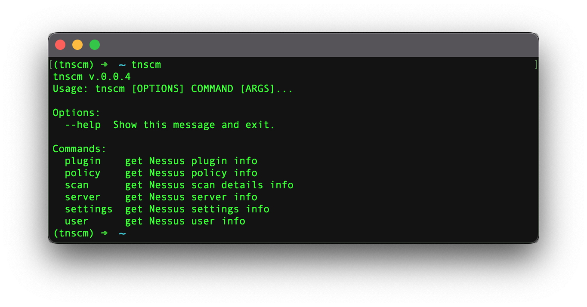

:description: CLI tool which enables you to manage Tenable Nessus ® by Tenable, Inc. via API

TNSCM
=====

|tnscm_pepy_downloads| |stars_from_users| |latest_release| |latest_release_date| |license| |supported_platform|

TNSCM by LimberDuck is a |CLI| tool which enables you to perform certain actions on 
*Tenable Nessus* by (C) Tenable, Inc. via Nessus |API| used for |VA| [1]_ process.
It's free and Open Source [2]_ tool.

This tool will let you perform actions like:

- plugin family (``list``)
- policy (``list``, ``delete``)
- scan (``list``, ``delete``)
- server (``status``, ``licensed IPs``, ``version``)
- advanced settings (``list``)
- user (``list``)

.. grid:: 2 2 2 4

    .. grid-item::

      .. button-link:: https://github.com/LimberDuck/tnscm
         :color: primary
         :outline:
         :tooltip: Check source code here

         :octicon:`code;1em;sd-color-primary-text` source code

    .. grid-item::

      .. button-link:: https://github.com/LimberDuck/tnscm/releases
         :color: primary
         :outline:
         :tooltip: Check release notes here

         :octicon:`note;1em;sd-color-primary-text` release notes

    .. grid-item::

      .. button-link:: https://github.com/LimberDuck/tnscm/discussions
         :color: primary
         :outline:
         :tooltip: Discuss here

         :octicon:`comment-discussion;1em;sd-color-primary-text` discussions

    .. grid-item::

      .. button-link:: https://github.com/LimberDuck/tnscm/issues
         :color: primary
         :outline:
         :tooltip: Report issues here

         :octicon:`issue-opened;1em;sd-color-primary-text` issues

   TNSCM |CLI| running in Terminal

Technology stack
----------------

.. image:: https://www.python.org/static/community_logos/python-logo-master-v3-TM.png
   :alt: Python logo
   :target: https://python.org
   :width: 220px

Stargazers over time
--------------------

.. figure:: https://starchart.cc/LimberDuck/tnscm.svg?variant=adaptive
    :target: https://starchart.cc/LimberDuck/tnscm
    :alt: Stargazers over time
    :align: center

    TNSCM GitHub repository stars over time.

----

.. rubric:: Footnotes

.. [1] read more about :term:`Vulnerability Assessment` in glossary
.. [2] read more about :term:`Open Source` in glossary

.. |license| image:: https://img.shields.io/github/license/LimberDuck/tnscm.svg?style=social
    :target: https://github.com/LimberDuck/tnscm/blob/master/LICENSE
    :alt: License

.. |supported_platform| image:: https://img.shields.io/badge/platform-Windows%20%7C%20macOS%20%7C%20Linux-lightgrey.svg?style=social
    :target: https://github.com/LimberDuck/tnscm
    :alt: Supported platform

.. |latest_release| image:: https://img.shields.io/github/v/release/LimberDuck/tnscm?label=Latest%20release&style=social
    :target: https://github.com/LimberDuck/tnscm/releases
    :alt: Latest Release version

.. |latest_release_date| image:: https://img.shields.io/github/release-date/limberduck/tnscm?label=released&style=social
    :target: https://github.com/LimberDuck/tnscm/releases
    :alt: GitHub Release Date

.. |pypi_downloads| image:: https://img.shields.io/pypi/dm/tnscm?logo=PyPI&style=social   
    :target: https://pypistats.org/packages/tnscm
    :alt: PyPI - Downloads

.. |stars_from_users| image:: https://img.shields.io/github/stars/LimberDuck/tnscm?label=Stars&style=social
    :target: https://github.com/LimberDuck/tnscm
    :alt: GitHub Stars

.. |tnscm_pepy_downloads| image:: https://img.shields.io/pepy/dt/tnscm?logo=PyPI&style=social   
    :target: https://pepy.tech/projects/tnscm
    :alt: pepy.tech - Total Downloads
