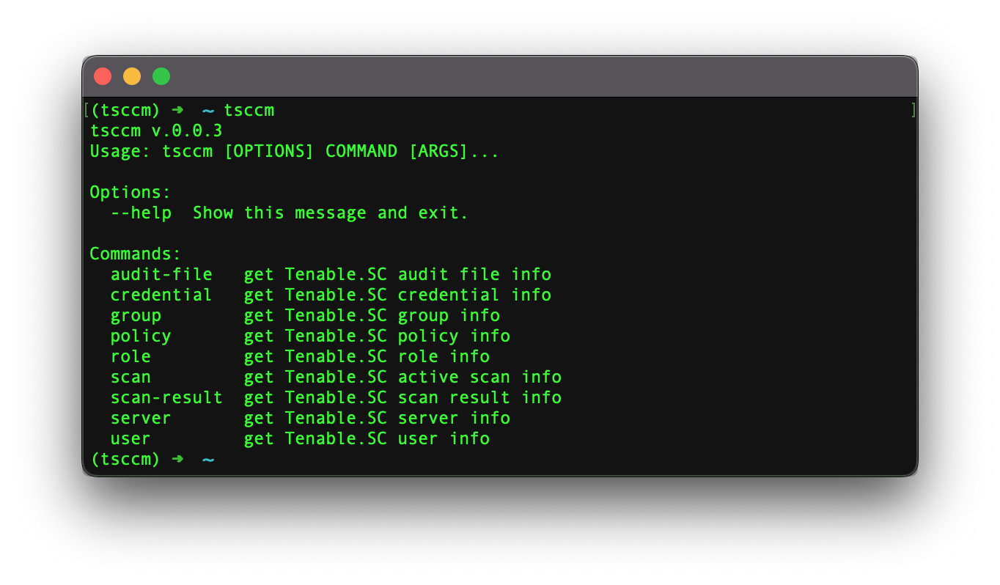

:description: CLI tool which enables you to manage Tenable Security Center ® by Tenable, Inc. via API.

TSCCM
=====

|tsccm_pepy_downloads| |stars_from_users| |latest_release| |latest_release_date| |license| |supported_platform|

TSCCM by LimberDuck is a |CLI| tool which enables you to perform certain actions on 
*Tenable Security Center* by (C) Tenable, Inc. via 
`Tenable Security Center API <https://docs.tenable.com/tenablesc/api>`_ used for |VA| [1]_ process. 
It's free and Open Source [2]_ tool.

This tool will let you perform actions like:

- audit file (``list``)
- credential (``list``)
- group (``list``)
- policy (``list``)
- role (``list``)
- active scan (``list``)
- scan result (``list``)
- server (``status``, ``licensed IPs``, ``version``)
- user (``list``)

.. grid:: 2 2 2 4

    .. grid-item::

      .. button-link:: https://github.com/LimberDuck/tsccm/releases
         :color: primary
         :outline:
         :tooltip: Release notes

         :octicon:`note;1em;sd-color-primary-text` Release notes

    .. grid-item::

      .. button-link:: https://github.com/LimberDuck/tsccm
         :color: primary
         :outline:
         :tooltip: Source code

         :octicon:`code;1em;sd-color-primary-text` Source code

    .. grid-item::

      .. button-link:: https://github.com/LimberDuck/tsccm/discussions
         :color: primary
         :outline:
         :tooltip: Discussions

         :octicon:`comment-discussion;1em;sd-color-primary-text` Discussions

    .. grid-item::

      .. button-link:: https://github.com/LimberDuck/tsccm/issues
         :color: primary
         :outline:
         :tooltip: Issues

         :octicon:`issue-opened;1em;sd-color-primary-text` Issues

   TSCCM |CLI| running in Terminal

Technology stack
----------------

.. image:: https://www.python.org/static/community_logos/python-logo-generic.svg
   :alt: Python logo
   :target: https://python.org
   :width: 220px

Stargazers over time
--------------------

.. figure:: https://starchart.cc/LimberDuck/tsccm.svg?background=%23ffffff00&axis=%23E57333&line=%23E57333
    :target: https://starchart.cc/LimberDuck/tsccm
    :alt: Stargazers over time
    :align: center

    TSCCM GitHub repository stars over time.

----

.. rubric:: Footnotes

.. [1] read more about :term:`Vulnerability Assessment` in glossary
.. [2] read more about :term:`Open Source` in glossary

.. |license| image:: https://img.shields.io/github/license/LimberDuck/tsccm.svg?style=social
    :target: https://github.com/LimberDuck/tsccm/blob/master/LICENSE
    :alt: License

.. |supported_platform| image:: https://img.shields.io/badge/platform-Windows%20%7C%20macOS%20%7C%20Linux-lightgrey.svg?style=social
    :target: https://github.com/LimberDuck/tsccm
    :alt: Supported platform

.. |latest_release| image:: https://img.shields.io/github/v/release/LimberDuck/tsccm?label=Latest%20release&style=social
    :target: https://github.com/LimberDuck/tsccm/releases
    :alt: Latest Release version

.. |latest_release_date| image:: https://img.shields.io/github/release-date/limberduck/tsccm?label=released&style=social
    :target: https://github.com/LimberDuck/tsccm/releases
    :alt: GitHub Release Date

.. |pypi_downloads| image:: https://img.shields.io/pypi/dm/tsccm?logo=PyPI&style=social   
    :target: https://pypistats.org/packages/tsccm
    :alt: PyPI - Downloads

.. |stars_from_users| image:: https://img.shields.io/github/stars/LimberDuck/tsccm?label=Stars&style=social
    :target: https://github.com/LimberDuck/tsccm
    :alt: GitHub Stars

.. |tsccm_pepy_downloads| image:: https://img.shields.io/pepy/dt/tsccm?logo=PyPI&style=social   
    :target: https://pepy.tech/projects/tsccm
    :alt: pepy.tech - Total Downloads